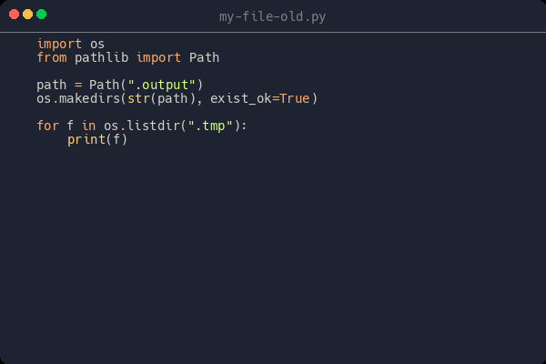
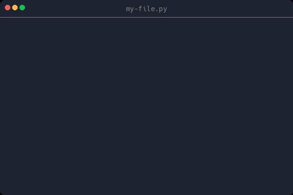
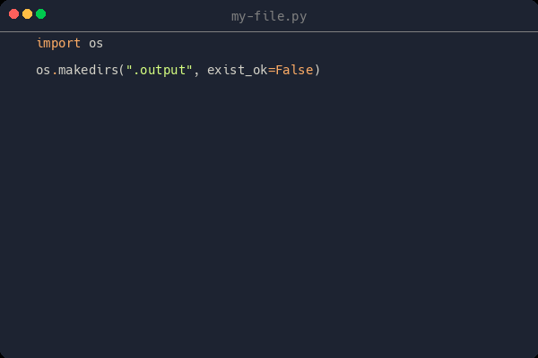
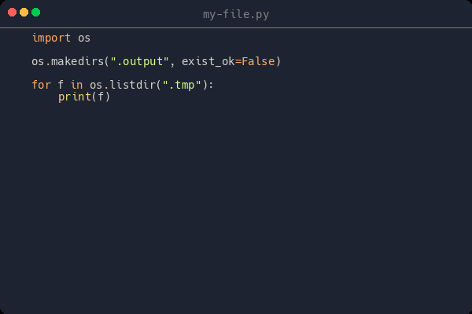
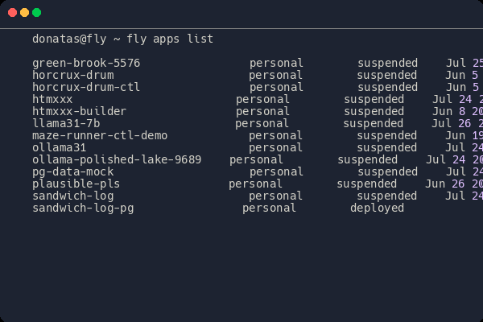

Ever wanted to give **motion** to your **l**ines **o**f **c**ode? - Now you can using **locomote**!

## Installation

The recommended method is to use `pipx`:

```sh
pipx install "git+https://github.com/fliepeltje/locomote"
```

## Usage

First, create a config file.
Refer to the [example](config.example.toml) and the [source](locomote/config.py) for references (until docs materialize).

Every key in the `toml` file corresponds to a single `locomote` config; 1 file can house multiple configs.

To run:

```sh
locomote <cnofig-path> <config-key>
```

## Demos


### Simple File

Go from blank file to your target file:

```sh
locomote config.example.toml my-file
```

[](https://github.com/user-attachments/assets/8c5ad74a-7581-4954-94ba-925f8695efd1)

### File Diff

Create a clip for every commit associated to a file

```sh
locomote config.example.toml my-file-diff
```


[](https://github.com/user-attachments/assets/6f181ddd-ea22-472a-90de-616d6b519ef4)

[](https://github.com/user-attachments/assets/a2098774-7d70-4fe5-a12c-83c2aa85fcaa)

[](https://github.com/user-attachments/assets/8d1a5ab1-2c22-4df5-b69a-4162c882c1df)


### Command + Log output

Create an animated output of your command

```sh
locomote config.example.toml fly-apps-list
```

[](https://github.com/user-attachments/assets/d4b46d5b-0e95-4029-ae75-5f0549ec1c53)
